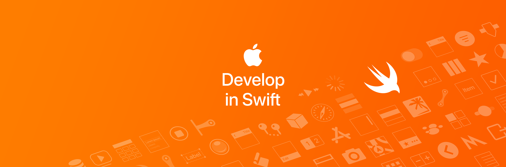

# Swift PT-BR 🇧🇷

## Descrição

Esse repositório contém informações para o aprendizado de Swift e desenvolvimento em IOS, preferencialmente em português brasileiro. A razão da criação deste repositório é a dificuldade de encontrar materiais em pt-br na presente data (09/01/2021).

Além disso, também contém links úteis sobre o mundo Apple.

---

## Índice

|                                                                     |                               |                           |
| :------------------------------------------------------------------ | :---------------------------: | :------------------------: |
| Artigos: Medium                                                     |  [PT-BR](#artigos-medium-pt-br)  |  [EN (indisponível)](#artigos-medium-en)  |
| Comunidades                                                         |   [PT-BR](#comunidades-pt-br)    |   [EN (indisponível)](#comunidades-en)    |
| Cursos gratuitos                                                    | [PT-BR](#cursos-gratuitos-pt-br) | [EN (indisponível)](#cursos-gratuitos-en) |
| Cursos pagos                                                        |   [PT-BR](#cursos-pagos-pt-br)   |   [EN (indisponível)](#cursos-pagos-en)   |
| Instagram                                                           |    [PT-BR](#instagram-pt-br)     |    [EN (indisponível)](#instagram-en)     |
| Livros                                                              |      [PT-BR](#livros-pt-br)      |      [EN (indisponível)](#livros-en)      |
| Podcasts                                                            |     [PT-BR](#podcasts-pt-br)     |     [EN (indisponível)](#podcasts-en)     |
| Sites                                                               |      [PT-BR](#sites-pt-br)       |      [EN](#sites-en)       |
| Youtube                                                             |     [PT-BR](#youtube-pt-br)      |     [EN](#youtube-en)      |

&nbsp;

| [Sobre o Apple Developer Academy](#sobre-o-apple-developer-academy) |
| :---------------------------|
| [Universidades Brasileiras](#universidades-brasileiras)             |

&nbsp;

<a href="https://appleeducation.catalog.instructure.com">Fonte da imagem</a>

---

### Artigos: Medium PT-BR

[Voltar ao índice](#índice)

[1] - [Academy@EldoradoCPS](https://medium.com/academy-eldoradocps)

[2] - [Apple Developer Academy | IFCE](https://medium.com/academy-ifce)

[3] - [Apple Developer Academy | Mackenzie](https://medium.com/mackmobile)

[4] - [Apple Developer Academy | Porto Alegre](https://medium.com/academy-poa)

[5] - [Apple Developer Academy | PUCPR](https://medium.com/apple-developer-academy-pucpr)

[6] - [Apple Developer Academy | SENAC](https://medium.com/academysenac)

[7] - [Apple Developer Academy | UCB Former BEPiD](https://medium.com/bepid-ucb-2017)

[8] - [Apple Developer Academy | UFPE](https://medium.com/academyufpe)

---

### Comunidades PT-BR

[Voltar ao índice](#índice)

[1] - [Discord: Rocketseat - #Swift](https://rocketseat.com.br)

Após a inscrição na Rocketseat, vá em "Discover" e depois em "Comunidade". O site vai ser redirecionado para o link de acesso da comunidade no Discord.

---
### Cursos gratuitos PT-BR

[Voltar ao índice](#índice)

[1] - [Stanford University: CS193p Iphone Application Development - Spring 2020](https://www.youtube.com/watch?v=yOhyOpXvaec&list=PLpGHT1n4-mAtTj9oywMWoBx0dCGd51_yG)

Obs: Abaixo, no link do [Youtube PT-BR](#youtube-pt-br), o [Filipe Deschamps](https://github.com/filipedeschamps) ensina como ativar as legendas em português brasileiro da lista de vídeos do curso da Stanford, mencionado acima.

[2] - [Digital Innovation One: Conhecendo a base do Swift](https://digitalinnovation.one/cursos/conhecendo-a-base-do-swift)

---

### Cursos pagos PT-BR

[Voltar ao índice](#índice)

[1] - [Alura: Formação IOS](https://www.alura.com.br/formacao-ios)

--- 

### Instagram PT-BR

[Voltar ao índice](#índice)

[1] - [Nina Talks | UX Design e Tech by Karina Tronkos](https://www.instagram.com/nina_talks/)

---

### Livros PT-BR

[Voltar ao índice](#índice)

[1] - [Casa do Código: Swift - Programe para Iphone e Ipad. Escrito por Guilherme Silveira e Joviane Jardim.](https://www.casadocodigo.com.br/products/livro-swift-ios)

Obs: Na escolha do E-book, voce terá o direito de acesso às futuras atualizações do livro.

---

### Podcasts PT-BR

[Voltar ao índice](#índice)

[1] - [Build Failed Podcast (pt-br)](https://open.spotify.com/show/6sOFIDT8ELXygixjYBTAb2?si=WcdJEoecRtiq2AY5_U2gQw)

Apresentado por [Bruno Ramos (desenvolvedor IOS no IFood)](https://github.com/bruno-hcr), [Fabrício Serralvo (desenvolvedor IOS no IFood)](https://github.com/serralvo) e [Bruno Rocha (desenvolvedor IOS no Spotify)](https://github.com/rockbruno).

[2] - [MacMagazine no Ar](https://open.spotify.com/show/52IrqJ0ZwPVp0kKXaOWnLP?si=bRsNjP24QyG7Pqol_evtEw)

Podcast do [MacMagazine](https://macmagazine.com.br), um dos maiores sites sobre o mundo Apple no Brasil e na língua portuguesa.

---

### Sites PT-BR

[Voltar ao índice](#índice)

[1] - [DevMedia: Desenvolvimento IOS: Conheça a linguagem Swift (2014)](https://www.devmedia.com.br/desenvolvimento-ios-conheca-a-linguagem-swift/31860)

[2] - [Código Fonte: 5 dicas para se tornar um desenvolvedor de Swift (2017)](https://www.codigofonte.com.br/artigos/5-dicas-para-se-tornar-um-desenvolvedor-de-swift)

[3] - [MacMagazine: Apple leva linguagem de programação Swift ao Windows (22/09/2020)](https://macmagazine.com.br/post/2020/09/22/apple-leva-linguagem-de-programacao-swift-ao-windows/)

---

### Youtube PT-BR

[Voltar ao índice](#índice)

#### Canais

[1] - [Dev PUC-Rio](https://www.youtube.com/channel/UCWb9EHguiXaEvLcGZiydIqA)

[2] - [Entendendo Iphone](https://www.youtube.com/channel/UCAz_Eszk3YjqVLw6oXbSKQA)

[3] - [MacMagazine](https://www.youtube.com/channel/UC6ZImLwiIaVRYIGycqh5iLA)

[4] - [Nina Talks by Karina Tronkos](https://www.youtube.com/channel/UCiePf3WjIZGshGRkioCUGgQ)

[5] - [Thiago Aguiar](https://www.youtube.com/channel/UCrWWMZ6GVOM5zqYAUI44XXg)

#### Vídeos / Playlists

[1] - [Attekita Dev: Aprenda Swift e se torne um desenvolvedor IOS com cursos gratuitos 📱](https://www.youtube.com/watch?v=OV47giYphmk&t)

[2] - [Código Fonte TV: Swift (a linguagem do IOS)](https://www.youtube.com/watch?v=ELa-PgWlYDI)

[3] - [Filipe Deschamps: Curso grátis Swift e SwiftUI (Stanford 2020)](https://www.youtube.com/watch?v=r18Bvr3Dyfg&list=PLMdYygf53DP46rneFgJ7Ab6fJPcMvr8gC&index=1)

[4] - [Nina Talks: Unboxing Prêmios Apple Swift Student Challenge 2020](https://www.youtube.com/watch?v=i4SISbXTcjM)

[5] - [Thiago Aguiar: Tutoriais IOS](https://www.youtube.com/playlist?list=PLJ0AcghBBWSghADkQIbw-9I0m9WDOsI3s)

---

## Veja também:

### [LearnBR](https://github.com/learnbr): Um agrupador de link's de conteúdos para auxiliar no aprendizado ✌️

### | [Site](https://learnbr.github.io) | [Repositório](https://github.com/learnbr/swift)

---

&nbsp;
&nbsp;

# Conteúdos em Inglês

[Voltar ao índice](#índice)

### Instagram PT-BR

[1] - [Daily Dose of Swift by Pamela Ianovalli](https://www.instagram.com/dailydoseofswift/)

---

### Sites EN

[1] - [Hacking with Swift by Paul Hudson](https://www.hackingwithswift.com)

[2] - [Daily Dose of Swift by Pamela Ianovalli](https://dailydoseofswift.com)

---
### Youtube EN

#### Canais

[1] - [Paul Hudson from Hacking with Swift](https://www.youtube.com/channel/UCmJi5RdDLgzvkl3Ly0DRMlQ)

[2] - [Mayuko Inoue | IOS Engineer](https://www.youtube.com/channel/UCEDkO7wshcDZ7UZo17rPkzQ)

[3] - [Sara Dietschy | Rhymes with peachy](https://www.youtube.com/user/saradietschy)

[4] - [Daily Dose of Swift by Pamela Ianovalli](https://www.youtube.com/channel/UCabPpdhp4GMHWwXDldWUn4Q)

#### Vídeos / Playlists

[1] - [Paul Hudson: SwiftUI from Hacking with Swift](https://www.youtube.com/playlist?list=PLuoeXyslFTuaZtX7xSYbWz3TR0Vpz39gK)

[2] - [Paul Hudson: SwiftUI by Examples from Hacking with Swift](https://www.youtube.com/playlist?list=PLuoeXyslFTubw4NtepDCis5tTqK37zT3Q)

[3] - [Paul Hudson: Xcode in 20 seconds from Hacking with Swift](https://www.youtube.com/playlist?list=PLuoeXyslFTuYQ9Hoh42Bw8sPYMlTOV0V7)

[4] - [Paul Hudson: Hacking with Swift](https://www.youtube.com/playlist?list=PLuoeXyslFTuas6GrfsUiFPShGXmaVDbgN)

[5] - [Paul Hudson: Swift in Sixty Seconds from Hacking with Swift](https://www.youtube.com/playlist?list=PLuoeXyslFTuajnHpp2jKCyOz2ZhP5OTkN)

---

&nbsp;

## Sobre o Apple Developer Academy

[Voltar ao índice](#índice)

### O que é?

Essa iniciativa surgiu no Brasil, em 2013, e agora já está implementada também em outros países.

O programa oferece aos estudantes a oportunidade de implementar as suas próprias ideias, aprendendo e experienciando o desenvolvimento de um aplicativo ou jogo desde a sua concepção até a sua efetiva publicação na App Store. Além disto, recebem capacitação e tutoria em empreendedorismo, comunicação e marketing.

Os estudantes podem ingressar como desenvolvedores ou designers, recebendo capacitação de acordo com a sua área de atuação. Em vários momentos, os alunos trabalham em equipe para, em conjunto, promoverem a construção e o desenvolvimento de aplicativos e jogos.

Durante os dois anos de capacitação, os estudantes são encorajados atuarem com autonomia, o que faz com que eles estejam sempre engajados e se tornem profissionais de perfil diferenciado.

Para atingir os objetivos, emprega-se a metodologia de aprendizado baseado em desafios (CBL — Challenge Based Learning). Os professores especialistas, participantes do projeto, ajudam os estudantes a encontrarem seus próprios caminhos.

Fonte do texto: https://developeracademyucb.com.br

### Universidades Brasileiras

[1] - [FUCAPI - Fundação Centro de Análise, Pesquisa e Inovação Tecnológica - Manaus/AM]()

[2] - [IFCE - Instituto Federal de Educação, Ciência e Tecnologia do Ceará](http://developeracademy.ifce.edu.br)

[3] - [Instituto Eldorado - Campinas/SP](https://developeracademy.eldorado.org.br)

[4] - [Mackenzie](https://developeracademy.mackenzie.br)

[5] - [PUC-PR](http://developeracademy.pucpr.br)

[6] - [PUC-Rio](http://developeracademy.les.inf.puc-rio.br)

[7] - [PUC-RS](https://www.pucrs.br/blog/evento/apple-developer-academy-2021/)

[8] - [SENAC](http://developeracademy.sp.senac.br)

[9] - [UCB - Universidade Católica de Brasília](https://developeracademyucb.com.br)

[10] - [UFPE - Universidade Federal do Pernambuco](https://academy.cin.ufpe.br/index.php/pt/academia/)

---

### Youtube A-D-A

[1] - [PUC-Rio: O que é desenvolver? - Apple Developer Academy](https://www.youtube.com/watch?v=5AIyzNsfOzk)

[2] - [PUCPR: História de um desafio](https://www.youtube.com/watch?v=tYU8npYmJjA)

[3] - [Giovana Garcia Ribeiro: Vídeo de inscrição "Ensine algo que você sabe" para o processo seletivo Apple Developer Academy 2021/22](https://www.youtube.com/watch?v=X_qupS862DY)

---

## Contribuições sempre são bem-vindas 👨🏻‍💻

- [x] Faça um fork deste repositório (https://github.com/HenriqueMAP/swift-pt-br/fork);
- [x] Crie um branch com as suas modificações ` git checkout -b my-new-resource `;
- [x] Faça commit `git commit -am 'Adicionando um novo recurso ...'`;
- [x] Faça um Push ` git push origin my-new-feature ` ;
- [x] Crie uma nova pull request neste repositório. :octocat:

**Depois que sua pull request for merged, você pode excluir sua branch tranquilamente.**

## [Voltar ao topo ^](#índice)

&nbsp;

## Repositório desenvolvido por Henrique Matheus Alves Pereira 🦁
